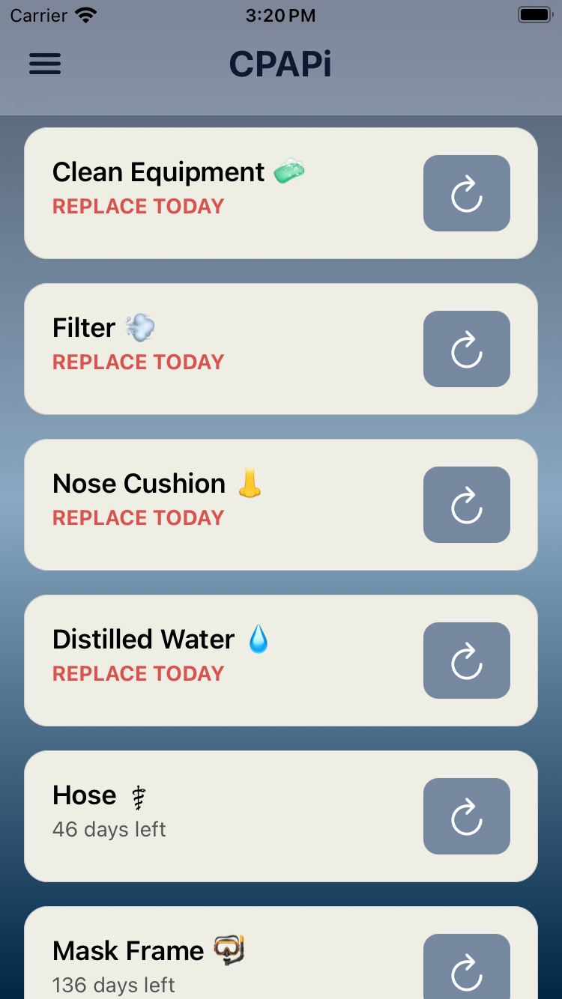

# CPAPi

<p align="center">
  
  
  
  
  
</p>

---

### 🫁 CPAP Supply Reminder App

**CPAPi** helps users track and replace their CPAP supplies on time.  
Supplies include **Mask, Nose Cushion, Hose, Water Supply, and Filter**.

- ✅ Add, edit, and delete reminders  
- ✅ Reset reminders when equipment is replaced  
- ✅ Scheduled **local notifications** at a chosen bedtime  
- ✅ Automatic defaults on first launch  
- 🕓 Roadmap: Snooze overdue reminders, backup/export, theming  

---

## 📸 Screenshots

<p align="center">
  
  
  
</p>

*(Screenshots coming soon — add iOS/Android captures in `docs/screenshots/`)*

---

## 🚀 Getting Started

### 1. Clone and Install
```bash
git clone https://github.com/YOUR_USERNAME/cpapi.git
cd cpapi
npm install
```

### 2. Run with Expo
```bash
npx expo start
```

Press `i` → iOS Simulator  
Press `a` → Android Emulator  
Or scan the QR code in Expo Go  

---

## 📂 Project Structure
```
app/                # Screens and navigation
  (tabs)/           # Reminders + Settings
  _layout.tsx       # Root layout
lib/                # Local database + notifications
  db.ts             # SQLite helpers
  notifications.ts  # Notification scheduling
```

---

## 🗄️ Database

**Powered by Expo SQLite**  

**Table: supplies**  

**Columns:**  
- id (PK)  
- skey (stable key)  
- label (display name)  
- intervalDays (when to replace)  
- lastReplaced (date)  
- notifyHour + notifyMinute (bedtime notifications)  
- notificationId (tracks scheduled reminder)  
- snoozedUntil (future feature)  

Auto-seeds defaults on first run  

---

## 🔔 Notifications

Uses **expo-notifications**  
- Scheduled local notifications only (no remote push yet)  
- Notifications are canceled + re-scheduled automatically when:  
  - A reminder is edited  
  - A supply is replaced  
  - A reminder is deleted  

⚠️ Note: Expo Go has limitations — use a development build for full notification support.  

---

## 🛠️ Scripts
```bash
npm start       # Start Expo bundler
npm run ios     # Run on iOS simulator
npm run android # Run on Android emulator
npm run web     # Run in web (limited support)
```

---

## 📝 Roadmap

- Add / Edit / Delete reminders  
- Local notifications at custom times  
- Confirm before deleting  
- Snooze overdue reminders by +1 day  
- Light/Dark mode toggle  
- Export/Import backup of reminders  

---

## 🤝 Contributing

PRs and issues welcome! Please fork the repo and open a pull request with clear commit history.  
For major changes, open an issue first to discuss what you’d like to change.  

---

## ⚖️ License

MIT License © 2025 Joseph McGarry
